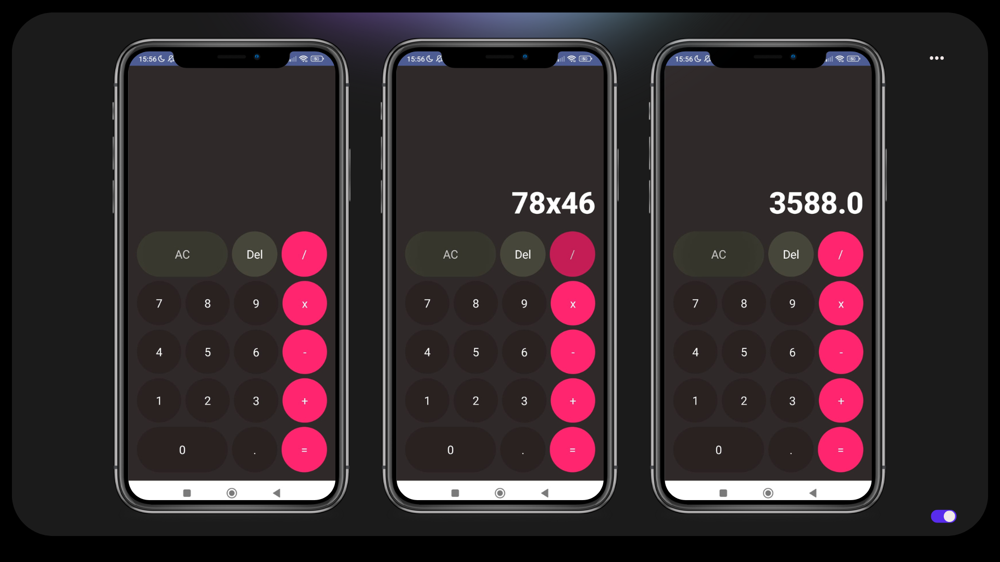

# CalculatorApps
Create a calculator application using compose as a base view and Kotlin. This application can perform arithmetic operators such as addition, division, multiplication, subtraction, and also decimal numbers or using integer numbers

## Features
- Addition
- Division
- Multiplication
- Subtraction
- Use decimal numbers or using integer numbers

## Preview 

     

